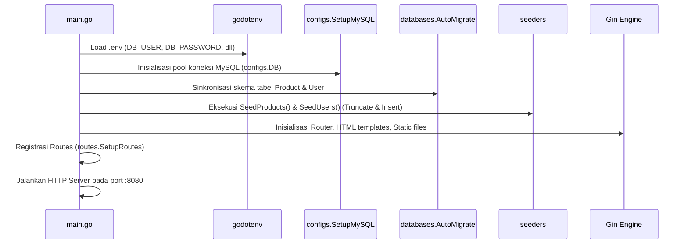

# 📚 Panduan Lengkap & Rencana Belajar 5 Hari: Go E-Commerce Backend

Selamat datang kembali! Dokumen ini disusun khusus untuk membantu Anda mengingat kembali seluruh arsitektur, tech stack, dan alur logika dari repository **ProjectEcommerceGolang_BNCC** ini. Di bagian akhir, terdapat silabus belajar bertahap selama **5 hari** agar Anda bisa menguasai kembali kodingan ini langkah demi langkah dengan nyaman.

---

## 🧭 1. Ringkasan Proyek & Tech Stack

Aplikasi ini adalah **sistem backend e-commerce hybrid** yang menggabungkan:
1. **Server-Side Rendered (SSR) Web Application**: Halaman Admin Dashboard, manajemen user & produk, serta katalog publik menggunakan HTML Template bawaan Go dan Bootstrap 4.
2. **RESTful API**: Endpoint berformat JSON untuk konsumsi aplikasi klien (mobile app, frontend SPA, atau testing melalui Postman).

### 🛠️ Rincian Teknologi yang Digunakan

| Komponen | Teknologi | Versi | Peran dalam Proyek |
| :--- | :--- | :--- | :--- |
| **Bahasa Utama** | Go (Golang) | `1.24.6` | Bahasa pemrograman utama berkecepatan tinggi dan concurrency-safe. |
| **Web Framework** | [Gin Gonic](https://github.com/gin-gonic/gin) | `v1.10.1` | Router HTTP, parsing form/JSON, session cookie, dan rendering HTML. |
| **Database ORM** | [GORM](https://gorm.io/) | `v1.30.1` | Object-Relational Mapping untuk memetakan struct Go ke tabel MySQL. |
| **Database Driver** | MySQL Driver | `v1.9.3` / `v1.6.0` | Driver komunikasi jaringan protokol MySQL. |
| **Keamanan / Auth** | JWT (`golang-jwt/jwt/v5`) | `v5.3.0` | Penerbitan dan validasi token autentikasi berbasis stateless token. |
| **Enkripsi Sandi** | Bcrypt (`golang.org/x/crypto`) | `v0.41.0` | Algoritma hashing satu arah untuk password pengguna. |
| **Export Dokumen** | [Excelize v2](https://github.com/qax-os/excelize) | `v2.9.1` | Pembuatan dan download file spreadsheet `.xlsx` secara dinamis. |
| **Konfigurasi** | Godotenv | `v1.5.1` | Membaca variabel environment dari file `.env`. |
| **Tampilan / UI** | Go `html/template` + Bootstrap 4 | `4.0.0 CDN` | Template engine HTML server-side dengan styling Bootstrap. |

---

## ⚙️ 2. Cara Kerja Kodingan & Logika Alur Sistem

Mari kita bedah bagaimana kode di dalam folder [`Day10/`](file:///c:/Users/LOQ/Documents/Project_listrik/ProjectEcommerceGolang_BNCC/Day10/) saling terhubung:

### A. Alur Bootstrapping Server (`main.go`)
Ketika Anda menjalankan perintah `go run main.go`:


1. **Defer Recovery**: Baris 24-28 menyiapkan fungsi penangkap error (`recover()`) agar aplikasi tidak langsung mati mendadak jika terjadi panic fatal.
2. **Membaca Lingkungan**: `godotenv.Load()` membaca kredensial database dari file [`.env`](file:///c:/Users/LOQ/Documents/Project_listrik/ProjectEcommerceGolang_BNCC/Day10/.env).
3. **Membuka Database**: `configs.SetupMySQL()` membuat koneksi DSN MySQL dan menyimpannya di variabel global `configs.DB`.
4. **Auto-Migrasi**: `databases.AutoMigrate()` memeriksa apakah tabel `products` dan `users` sudah ada di database, lalu membuat atau memperbarui kolomnya sesuai struct.
5. **Seeder Data**: Memasukkan user admin default dan dummy data produk.
6. **Mendaftarkan Route & Menjalankan Server**: Engine Gin mendaftarkan endpoint publik, API, dan admin, lalu mulai mendengar request di port `8080`.

---

### B. Alur Autentikasi & Keamanan (JWT & Cookies)
Bagaimana user login dan rute admin dilindungi?
```mermaid
graph TD
    A[User Mengisi Form Login /admin/login] --> B[Handler Login()]
    B --> C{Cek Username & Bcrypt Password}
    C -- Salah --> D[Kembalikan 401 Unauthorized]
    C -- Benar --> E[Generate Token JWT HS256]
    E --> F[Simpan Token di Cookie 'token']
    F --> G[Redirect ke /admin/dashboard]

    subgraph Akses Route Admin Terproteksi
    H[Request ke /admin/*] --> I[AuthMiddleware()]
    I --> J{Ada Header Bearer atau Cookie 'token'?}
    J -- Tidak Ada / Expired --> K[Abort 401 Unauthorized]
    J -- Valid --> L[Set Context 'username' & c.Next()]
    L --> M[Handler Dashboard / CRUD Produk / CRUD User]
    end
```

- Login bisa diakses melalui Web Form maupun REST API.
- Password diverifikasi dengan fungsi aman `bcrypt.CompareHashAndPassword()`.
- Token berlaku selama 24 jam.
- `AuthMiddleware` sangat fleksibel: ia mengecek header `Authorization: Bearer <token>` terlebih dahulu. Jika tidak ada, ia mengecek cookie bernama `token` (memungkinkan navigasi web browser biasa tanpa JavaScript tambahan).

---

### C. Alur Data & CRUD (Model-View-Controller)
Setiap entitas memiliki 3 layer utama:
1. **Model ([`Day10/models/`](file:///c:/Users/LOQ/Documents/Project_listrik/ProjectEcommerceGolang_BNCC/Day10/models/))**: 
   - `Product`: ID, Nama, Stok, Harga, Waktu dibuat/diubah.
   - `User`: ID, Username, Password (hash), Email, Status aktif (IsActive).
   - Keduanya mewarisi `gorm.Model` yang otomatis memberikan fitur **Soft Delete** (data tidak langsung hilang dari database, melainkan diisi tanggal `deleted_at`).
2. **Handlers ([`Day10/handlers/`](file:///c:/Users/LOQ/Documents/Project_listrik/ProjectEcommerceGolang_BNCC/Day10/handlers/))**:
   - Menerima input dari pengguna (bisa dari Form HTML via `c.PostForm` atau JSON via `c.ShouldBindJSON`).
   - Melakukan query ke database melalui `configs.DB`.
3. **Views ([`Day10/views/`](file:///c:/Users/LOQ/Documents/Project_listrik/ProjectEcommerceGolang_BNCC/Day10/views/))**:
   - Template file `.html` yang menggunakan sintaks kurung kurawal ganda (contoh: `{{ .products }}` dan `{{ .title }}`) untuk menampilkan data dinamis dari handler ke browser.

---

### D. Fitur Ekspor Excel (`excelize`)
Pada endpoint `GET /products/export`:
- Mengambil seluruh data produk dari tabel `products`.
- Menggunakan library `excelize` untuk membuat file spreadsheet baru secara virtual di memori.
- Menuliskan header kolom (`ID`, `Name`, `Price`, `Stock`, `Created At`).
- Mengatur header HTTP `Content-Type: application/vnd.openxmlformats-officedocument.spreadsheetml.sheet` dan `Content-Disposition: attachment; filename="products.xlsx"`.
- Mengalirkan file biner langsung ke pengguna via `f.Write(c.Writer)`.

---

### ⚠️ Catatan Penting Mengenai Bug yang Ada
Selama proses audit pemetaan codebase, ditemukan beberapa hal krusial yang perlu Anda perhatikan:
1. **Bug Hapus Produk ([`handlers/product-handler.go:153`](file:///c:/Users/LOQ/Documents/Project_listrik/ProjectEcommerceGolang_BNCC/Day10/handlers/product-handler.go#L153))**:
   Fungsi `DeleteProduct` tidak sengaja memanggil `configs.DB.Delete(&models.User{}, id)`. Akibatnya, saat admin berniat menghapus produk, sistem malah menghapus **User** yang memiliki ID yang sama!
2. **Password User Baru Belum Di-hash ([`handlers/user-handler.go:51`](file:///c:/Users/LOQ/Documents/Project_listrik/ProjectEcommerceGolang_BNCC/Day10/handlers/user-handler.go#L51))**:
   Fungsi `CreateUser` memasukkan password mentah ke database tanpa `bcrypt.GenerateFromPassword`. Akibatnya user baru tidak akan bisa login.
3. **Seeder Mereset Data Setiap Kali Server Restart ([`seeders/seeder-products.go:19`](file:///c:/Users/LOQ/Documents/Project_listrik/ProjectEcommerceGolang_BNCC/Day10/databases/seeders/seeder-products.go#L19))**:
   Perintah `TRUNCATE TABLE` dijalankan setiap server menyala. Data baru yang Anda input akan terhapus jika server di-restart.

*(Kita akan jadikan perbaikan bug-bug ini sebagai latihan praktis di hari ke-5!)*

---

## 📅 3. Silabus Rencana Belajar 5 Hari (5-Day Revision Plan)

Rencana ini dirancang sekitar 1-2 jam per hari agar Anda dapat menguasai kembali repository ini secara bertahap.

```
┌──────────────────────────────────────────────────────────────────────────┐
│                            RENCANA 5 HARI                                │
├──────────────┬───────────────────────────────────────────────────────────┤
│ Hari 1       │ Setup, Environment, Database Connection & Server Boot     │
│ Hari 2       │ Model Data, GORM ORM & Seeder                             │
│ Hari 3       │ Routing Gin, Middleware Auth & Mekanisme Token JWT        │
│ Hari 4       │ Handlers Bisnis, Form HTML vs REST API & Views Template   │
│ Hari 5       │ Fitur Ekspor Excel, Perbaikan Bug Kritis & Refactoring    │
└──────────────┴───────────────────────────────────────────────────────────┘
```

---

### 📌 Hari 1: Setup, Environment, Database Connection & Server Boot

**🎯 Target**: Memahami bagaimana aplikasi pertama kali hidup, membaca konfigurasi, dan terhubung ke MySQL.

- [ ] **Bahan Bacaan & Kode**:
  1. Buka dan pelajari [`Day10/.env`](file:///c:/Users/LOQ/Documents/Project_listrik/ProjectEcommerceGolang_BNCC/Day10/.env): Pahami parameter koneksi database (`DB_USER`, `DB_PASSWORD`, `DB_HOST`, `DB_PORT`, `DB_NAME`).
  2. Buka [`Day10/configs/database.go`](file:///c:/Users/LOQ/Documents/Project_listrik/ProjectEcommerceGolang_BNCC/Day10/configs/database.go):
     - Pelajari bagaimana fungsi `SetupMySQL()` membentuk string DSN (*Data Source Name*).
     - Pahami variabel global `var DB *gorm.DB`.
  3. Buka [`Day10/main.go`](file:///c:/Users/LOQ/Documents/Project_listrik/ProjectEcommerceGolang_BNCC/Day10/main.go):
     - Amati blok `defer func() { recover() }()` untuk menangani crash.
     - Pahami urutan inisialisasi: `godotenv.Load()` ➔ `configs.SetupMySQL()` ➔ `databases.AutoMigrate()`.
- [ ] **Latihan Mandiri**:
  - Jalankan MySQL di komputer Anda (via XAMPP atau Docker).
  - Pastikan database `ecommerce_db` sudah dibuat di MySQL (`CREATE DATABASE ecommerce_db;`).
  - Buka terminal di folder `Day10/` dan jalankan:
    ```powershell
    cd Day10
    go run main.go
    ```
  - Amati log di terminal saat database berhasil terhubung.

---

### 📌 Hari 2: Model Data, GORM ORM & Seeder

**🎯 Target**: Memahami struktur entitas data dan bagaimana GORM mengelola tabel secara otomatis.

- [ ] **Bahan Bacaan & Kode**:
  1. Buka [`Day10/models/product.go`](file:///c:/Users/LOQ/Documents/Project_listrik/ProjectEcommerceGolang_BNCC/Day10/models/product.go) & [`models/user.go`](file:///c:/Users/LOQ/Documents/Project_listrik/ProjectEcommerceGolang_BNCC/Day10/models/user.go):
     - Pelajari arti `gorm.Model` (otomatis menyertakan `ID`, `CreatedAt`, `UpdatedAt`, `DeletedAt`).
     - Pelajari tag struct: `json:"name"` (untuk format JSON) dan `form:"name"` (untuk form HTML).
  2. Buka [`Day10/databases/automigrate.go`](file:///c:/Users/LOQ/Documents/Project_listrik/ProjectEcommerceGolang_BNCC/Day10/databases/automigrate.go):
     - Pahami cara kerja `AutoMigrate(&models.Product{}, &models.User{})`.
  3. Buka [`Day10/databases/seeders/seeder-user.go`](file:///c:/Users/LOQ/Documents/Project_listrik/ProjectEcommerceGolang_BNCC/Day10/databases/seeders/seeder-user.go):
     - Pelajari fungsi `hashPassword()` yang memanfaatkan `bcrypt.GenerateFromPassword()`.
     - Pahami bagaimana data awal disisipkan dengan `configs.DB.Create(&users)`.
- [ ] **Latihan Mandiri**:
  - Buka phpMyAdmin atau database GUI (DBeaver/Navicat/MySQL Workbench).
  - Periksa tabel `products` dan `users`. Lihat bagaimana kolom `deleted_at` dibuat oleh GORM.
  - Cek kolom `password` pada tabel `users` untuk melihat contoh hasil hash Bcrypt.

---

### 📌 Hari 3: Routing Gin, Middleware Auth & Mekanisme Token JWT

**🎯 Target**: Menguasai sistem keamanan, pembagian rute publik vs terproteksi, serta lifecycle JWT.

- [ ] **Bahan Bacaan & Kode**:
  1. Buka [`Day10/middlewares/jwt.go`](file:///c:/Users/LOQ/Documents/Project_listrik/ProjectEcommerceGolang_BNCC/Day10/middlewares/jwt.go):
     - Pelajari fungsi `GenerateToken(username)`: bagaimana payload claims (`Subject`, `ExpiresAt`, `IssuedAt`) dibuat dan ditandatangani dengan algoritma `HS256`.
     - Pelajari fungsi `AuthMiddleware()`: bagaimana token diekstraksi dari header `Authorization: Bearer ...` ATAU dari cookie browser `token`.
     - Pahami bagaimana fungsi memvalidasi keaslian tanda tangan token.
  2. Buka [`Day10/handlers/auth-handler.go`](file:///c:/Users/LOQ/Documents/Project_listrik/ProjectEcommerceGolang_BNCC/Day10/handlers/auth-handler.go):
     - Pelajari fungsi `Login()`: pencarian user di database ➔ pencocokan hash password dengan `bcrypt.CompareHashAndPassword()` ➔ pembuatan token ➔ penyimpanan token ke cookie dengan `c.SetCookie("token", token, ...)` ➔ redirect ke dashboard.
  3. Buka [`Day10/routes/route.go`](file:///c:/Users/LOQ/Documents/Project_listrik/ProjectEcommerceGolang_BNCC/Day10/routes/route.go):
     - Pahami perbedaan rute publik vs grup terproteksi `admin := r.Group("/admin", middlewares.AuthMiddleware())`.
- [ ] **Latihan Mandiri**:
  - Buka browser ke `http://localhost:8080/login`.
  - Coba login dengan username `admin` dan password `admin123`.
  - Buka Developer Tools (F12) di browser ➔ Tab *Application* ➔ *Cookies*. Temukan cookie bernama `token`.

---

### 📌 Hari 4: Handlers Bisnis, Form HTML vs REST API & Views Template

**🎯 Target**: Memahami alur kerja logika aplikasi (CRUD) dan bagaimana template HTML dirender dengan data dinamis.

- [ ] **Bahan Bacaan & Kode**:
  1. Buka [`Day10/handlers/dashboardadmin-handler.go`](file:///c:/Users/LOQ/Documents/Project_listrik/ProjectEcommerceGolang_BNCC/Day10/handlers/dashboardadmin-handler.go):
     - Pelajari cara menghitung statistik (`Count(&userCount)`, `Where("stock > ?", 0).Count(...)`).
     - Pelajari cara mengirim data ke template: `c.HTML(http.StatusOK, "home.html", gin.H{...})`.
  2. Buka [`Day10/views/home.html`](file:///c:/Users/LOQ/Documents/Project_listrik/ProjectEcommerceGolang_BNCC/Day10/views/home.html):
     - Pelajari sintaks loop: `{{ range $i, $p := .products }}` dan kondisional `{{ else }}`.
  3. Buka [`Day10/handlers/product-handler.go`](file:///c:/Users/LOQ/Documents/Project_listrik/ProjectEcommerceGolang_BNCC/Day10/handlers/product-handler.go):
     - Bandingkan handler web form (`CreateProducts`) yang memakai `c.PostForm` dan redirect browser, dengan handler REST API (`GetProductsAPI`) yang memakai `c.JSON()`.
  4. Buka [`Day10/handlers/public-handler.go`](file:///c:/Users/LOQ/Documents/Project_listrik/ProjectEcommerceGolang_BNCC/Day10/handlers/public-handler.go):
     - Pelajari fungsi `ShowProductsPage()` yang menampilkan katalog produk terbaru dan produk yang masih tersedia.
- [ ] **Latihan Mandiri**:
  - Masuk ke dashboard admin di browser (`http://localhost:8080/admin/dashboard`).
  - Buka menu *Products* (`/admin/products`), coba buat produk baru melalui form *Create Product*.
  - Uji endpoint JSON di browser atau Postman: `GET http://localhost:8080/api/products`.

---

### 📌 Hari 5: Fitur Ekspor Excel, Perbaikan Bug Kritis & Refactoring

**🎯 Target**: Memahami manipulasi file biner dengan Excelize dan memperbaiki kelemahan kode agar aplikasi production-ready.

- [ ] **Bahan Bacaan & Kode**:
  1. Buka [`Day10/handlers/public-handler.go:36-76`](file:///c:/Users/LOQ/Documents/Project_listrik/ProjectEcommerceGolang_BNCC/Day10/handlers/public-handler.go#L36-L76):
     - Pelajari alur pembuatan spreadsheet via `excelize.NewFile()`.
     - Pahami penulisan cell: `f.SetCellValue(sheet, "A1", "ID")`.
     - Pahami header HTTP attachment agar file terunduh otomatis sebagai `.xlsx`.
- [ ] **Latihan Praktik Perbaikan Bug (Hands-on Fixes)**:
  1. **Perbaiki Bug DeleteProduct**:
     - Buka [`Day10/handlers/product-handler.go:153`](file:///c:/Users/LOQ/Documents/Project_listrik/ProjectEcommerceGolang_BNCC/Day10/handlers/product-handler.go#L153).
     - Ubah `configs.DB.Delete(&models.User{}, id)` menjadi `configs.DB.Delete(&models.Product{}, id)`.
     - Ubah pesan log error dari `"Failed to delete user"` menjadi `"Failed to delete product"`.
  2. **Perbaiki Password Hash di CreateUser**:
     - Buka [`Day10/handlers/user-handler.go:39-64`](file:///c:/Users/LOQ/Documents/Project_listrik/ProjectEcommerceGolang_BNCC/Day10/handlers/user-handler.go#L39-L64).
     - Tambahkan enkripsi password sebelum simpan:
       ```go
       hashedPassword, err := bcrypt.GenerateFromPassword([]byte(password), bcrypt.DefaultCost)
       if err != nil {
           c.JSON(http.StatusInternalServerError, gin.H{"error": "Failed to hash password"})
           return
       }
       user := models.User{
           Username: username,
           Password: string(hashedPassword),
           Email:    email,
           IsActive: isActive,
       }
       ```
  3. **Cegah Truncate Otomatis pada Seeder**:
     - Buka [`Day10/databases/seeders/seeder-products.go`](file:///c:/Users/LOQ/Documents/Project_listrik/ProjectEcommerceGolang_BNCC/Day10/databases/seeders/seeder-products.go) dan [`seeder-user.go`](file:///c:/Users/LOQ/Documents/Project_listrik/ProjectEcommerceGolang_BNCC/Day10/databases/seeders/seeder-user.go).
     - Aktifkan logika pengecekan jumlah baris (yang sebelumnya di-comment): hanya seed jika `count == 0`, agar data buatan Anda tidak terhapus saat server di-restart.

---

## 💡 Ringkasan Shortcut Perintah Berguna

| Keperluan | Perintah (Jalankan di folder `ProjectEcommerceGolang_BNCC/Day10`) |
| :--- | :--- |
| **Menjalankan Server** | `go run main.go` |
| **Merapikan Dependencies** | `go mod tidy` |
| **Kompilasi File Binary** | `go build -o server.exe main.go` |
| **Download Dependensi Baru** | `go get <nama-package>` (contoh: `go get github.com/gin-gonic/gin`) |

---

*Dokumen ini dibuat otomatis sebagai referensi cepat dan panduan belajar Anda.*
